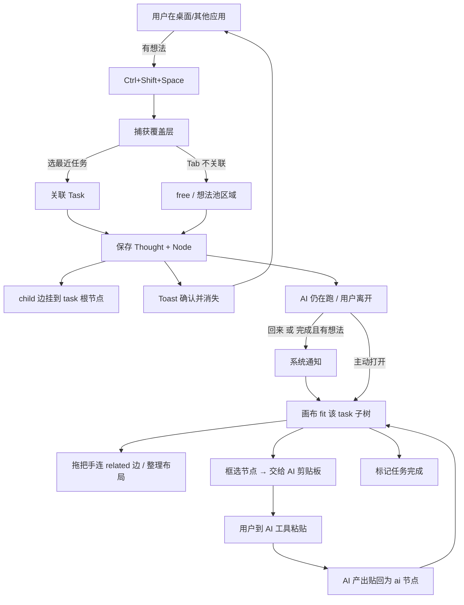

# 青萍助手 · 念头 —— 交互与技术方案

| 项 | 内容 |
| --- | --- |
| 产品 | 青萍助手 / 工具：念头 |
| 文档性质 | 交互表现形式 + 技术方案 |
| 依赖 | 《青萍助手-核心需求.md》 |
| 状态 | 初稿 |

---

## 0. 设计原则（约束一切交互与技术选择）

| 原则 | 含义 |
| --- | --- |
| **轻** | 唤起、记录、消失都在极短时间内完成；常驻资源占用低 |
| **低摩擦** | 记一条想法路径极短，默认选项几乎总是对的 |
| **空间可读** | 思维链以无限画布 + 脑图呈现：节点可拖、可连、可缩放，空间关系代替纯线性时间 |
| **可续** | 任何时刻都能从「任务画布」恢复完整上下文 |
| **本地优先** | 想法默认只存本机；联网是可选项 |
| **不抢戏** | 不替代 AI 工具，也不做成重笔记/白板软件 |

---

## 1. 交互表现形式

### 1.1 形态总览

念头不是一个「打开再用」的完整应用，而是一层**薄薄的协作壳**：

```
┌──────────────────────────────────────────────────────┐
│                    系统桌面 / 其他应用                    │
│  ┌────────────┐    ┌────────────┐    ┌────────────┐   │
│  │  AI 工具    │    │  编辑器     │    │  浏览器     │   │
│  └────────────┘    └────────────┘    └────────────┘   │
│         ▲                ▲                ▲          │
│         └────────────────┼────────────────┘          │
│                          │                           │
│         ┌────────────────▼────────────────┐          │
│         │  念头 · 薄壳层（托盘 + 唤起层）      │          │
│         │  · 全局快捷键捕获                  │          │
│         │  · 悬浮小控件 / 覆盖层              │          │
│         │  · 系统通知与续接提示                │          │
│         └────────────────┬────────────────┘          │
│                          │                           │
│         ┌────────────────▼────────────────┐          │
│         │  念头 · 主界面（需要时才展开）        │          │
│         │  任务时间线 · 想法池 · 续接卡         │          │
│         └─────────────────────────────────┘          │
└──────────────────────────────────────────────────────┘
```

分三层：

| 层 | 载体 | 何时出现 |
| --- | --- | --- |
| **捕获层** | 全局快捷键唤起的覆盖输入框、语音热键 | 随时，主动唤起；落点直接成为画布上的节点 |
| **常驻层** | 系统托盘图标 | 一直在，不打扰 |
| **串联/续接层** | **无限思维链画布**（主界面核心） | 打开应用、点通知、托盘选任务时 |

> **范式变更**：原「续接卡 = 线性时间线列表」升级为 **无限画布 + 脑图**。
> 时间线不再是一等公民 UI，而是从图数据里可导出的摘要视图。

### 1.2 思维链画布（核心表面）

参照无限画布工作台（如 basketikun/infinite-canvas 一类节点画布）与思维脑图的交互习惯，念头的「串」发生在一块可平移缩放的画布上。

#### 画布地图

```
        思维链画布（可平移 / 缩放 / 选框）
┌─────────────────────────────────────────────────────┐
│  ┌─────────┐         ┌──────────┐                   │
│  │ 想法池   │         │ 任务导航  │                   │
│  │ 未关联   │         └──────────┘                   │
│  └─────────┘                                        │
│                                                     │
│            ┌─────────────────┐                      │
│            │ 任务节点「重构登录」│                      │
│            │   status · 目标   │                      │
│            └────────┬────────┘                      │
│          ┌──────────┼──────────┐                    │
│          ▼          ▼          ▼                    │
│     ┌────────┐ ┌────────┐ ┌────────┐                │
│     │任务前   │ │等待中  │ │等待中  │                │
│     │约束    │ │OAuth  │ │设备指纹 │                │
│     └────────┘ └───┬────┘ └────────┘                │
│                    │  连线（边）                       │
│                    ▼                                 │
│               ┌────────┐                             │
│               │AI 产出  │                             │
│               └────────┘                             │
│                                                     │
│         ··· 独立想法节点（未挂任务，可散落）···            │
│  ┌──────────────────────┐                           │
│  │ 小地图 / 缩放 / 筛选   │                           │
│  └──────────────────────┘                           │
└─────────────────────────────────────────────────────┘
```

#### 节点类型（Node Kind）

| 类型 | 形态建议 | 含义 |
| --- | --- | --- |
| **task** | 大卡片，品牌绿描边，可折叠子树 | 一个 AI 任务的根节点；含目标、状态 |
| **thought** | 中等卡片，按 kind 着色/图标 | 人的想法（任务前 / 等待中 / 决策 / 疑问） |
| **ai** | 虚线或灰卡 | AI 产出摘要、阶段结果 |
| **free** | 与 thought 同，无入边到 task | 未关联任务的想法池内容（散落在画布一侧） |

#### 边（Edge）

| 边类型 | 视觉 | 含义 |
| --- | --- | --- |
| **child** | 实线，task→thought/ai | 归属：该想法/产出属于此任务 |
| **related** | 点线/细线，thought↔thought | 用户显式连接的相关想法（跨任务也可） |
| **sequence** | 箭头，可选 | 表达「先后/因果」 |

MVP 必做：`child` + `related`。`sequence` 可 P1。

#### 画布交互（与脑图/无限画布对齐）

| 操作 | 手势 | 说明 |
| --- | --- | --- |
| 平移 | 空白处拖拽 / 中键拖拽 / 空格+拖 | 全画布漫游 |
| 缩放 | 滚轮（以光标为锚）/ 触控捏合 | 双指或 ctrl+滚轮 |
| 移动节点 | 拖节点本体 | 位置持久化；吸附可选 |
| 选中 | 单击 | 出现工具条（连边、折叠、喂给 AI、删除） |
| 多选 | 框选 / Shift+点选 | 批量喂给 AI、批量挂任务 |
| 连边 | 从节点边缘「把手」拖到另一节点 | 创建 related；拖到 task 则变 child |
| 断边 | 选中边 → Delete / 点边上的× | |
| 新节点 | 双击空白 | 就地输入；或快捷键捕获层落下 |
| 折叠 | task 节点折叠子树 | 画布太满时收起支线 |
| 聚焦任务 | 双击任务列表项 / 通知 | 视口动画飞到该 task 并 fit 子树 |

#### 脑图布局策略

| 策略 | 说明 |
| --- | --- |
| **默认放射** | 打开任务时，task 居中，child 按时间/类型绕圈放射（类似中心主题脑图） |
| **用户自由** | 任何拖动不强制回排；「整理布局」按钮才重新放射/分层 |
| **分层可选** | 设置里可选「按时间左右流」（更接近时间线）或「放射脑图」 |

#### 捕获层如何落到画布

1. 热键唤起捕获层（与原设计一致，默认 chip 任务）
2. Enter 保存后：
   - 关联了 task → 新 thought 节点出现在 **该 task 子树靠近光标/最近空白** 的位置，并自动连一条 `child` 边
   - 不关联 → 节点出现在画布「想法池」区域
3. Toast 提示「已记入 · 重构登录」；若画布已打开，轻微脉冲高亮新节点

#### 续接（Resume）在画布上的表现

| 时机 | 表现 |
| --- | --- |
| 点通知 / 打开任务 | 画布视口平移缩放到该 task，子树 fit 进屏幕 |
| 有未消化等待中想法 | task 节点角标；可「只看未读」过滤 |
| 整理交给 AI | 勾选多个 thought 节点（或一键选中全部等待中）→ 生成结构化文本 → 剪贴板 |

线性时间线降级为：任务节点菜单 →「导出时间线摘要」（Markdown）。

### 1.3 捕获覆盖层（保留，规格微调）

| 项 | 规格 |
| --- | --- |
| 唤起 | 全局快捷键（默认 `Ctrl+Shift+Space`） |
| 位置 | 屏幕居中偏上；多显示器在当前焦点显示器 |
| 尺寸 | ~440×200，圆角 12 |
| 样式 | 深色半透明毛玻璃 + 顶部 2px 青萍绿描边 |
| 交互 | 自动聚焦；`Enter` 保存；`Esc` 关闭；`Tab` 切换任务 chip |
| 落点 | 保存后节点进入画布（见上）；画布未打开则只写入存储，打开时可见 |
| 反馈 | Toast；不强制抢焦点到画布 |

### 1.4 主界面布局（更新）

```
┌────────────────────────────────────────────────┐
│ 青萍助手          [画布] [想法池] [设置]      ─ □ ✕ │
├────────────────────────────────────────────────┤
│ 左栏 220px │                                    │
│ 任务列表    │         思维链画布（主区域）          │
│ · 进行中    │     pan / zoom / nodes / edges     │
│ · 已完成    │                                    │
│            │                                    │
│ [新建任务]  │  ┌─────────────────────────────┐  │
│            │  │ 工具条：连边 · 折叠 · 喂AI · …  │  │
│            │  └─────────────────────────────┘  │
├────────────┴────────────────────────────────────┤
│ 缩放 100% · 选中 2 · Ctrl+Shift+Space 捕获        │
└─────────────────────────────────────────────────┘
```

「想法池」页签 = 未关联 free 节点的列表视图（画布上也有对应区域）；点条目可「在画布中定位」。

### 1.5 通知

| 时机 | 内容 | 动作 |
| --- | --- | --- |
| 任务标记完成且有未消化想法 | 「重构登录：还有 2 条想法未处理」 | **打开画布并聚焦该 task** |
| P1 久未查看 | 「上次重构登录还有 1 条想法」 | 聚焦 / 忽略 |

### 1.6 语音交互（P1，接口先留）

| 项 | 规格 |
| --- | --- |
| 唤起 | 在捕获层按住麦标说话；松开结束 |
| 结果 | 转写进输入框；保存后同样落为节点 |
| 技术 | 见技术方案 §语音 |

### 1.7 品牌气质（简要）

- 命名意象：浮萍、水面、轻、捕捉
- **视觉方向**：明色 = 纸感陶土；暗色 = **对齐 infinite-canvas 的中性 zinc 暗色**
- 色板：
  | Token | Light（纸感） | Dark（infinite-canvas） |
  | --- | --- | --- |
  | bg | `#F3EDE3` | `#1F1F1F` |
  | panel | `#E9E1D2` | `#2A2A2A` |
  | elev（节点卡） | `#FFFBF3` | `#2E2E2E` |
  | line | `#D5C9B4` | `rgba(255,255,255,0.1)` |
  | text | `#2A2218` | `#FAFAFA` |
  | text-2 | `#6B5E4E` | `#A8A8A8` |
  | accent | 陶土 `#B85C38` | 靛蓝 `#5B6CFA`（侧栏强调） |
  | primary 按钮 | 陶土底 | **近白** `#FAFAFA` 底深字（对齐 IC） |
  | ai | 墨蓝 `#4A6FA5` | 天蓝 `#7DD3FC` |
- 主题切换：顶栏一键明/暗；可跟随系统 `prefers-color-scheme`
- 微交互：捕获层 120–160ms；画布飞行动画 ≤ 400ms；连边预览虚线跟随
- 文案：短、白话、无 AI 行话

---

## 2. 信息架构与数据模型

### 2.1 核心实体

```
Task（AI 任务）
  id, title, goal, status(draft|running|waiting_review|done|cancelled),
  source(manual|clipboard|extension|api), created_at, updated_at, meta json

Node（画布节点，一等公民）
  id, kind(task|thought|ai|free),
  ref_id,            -- task.id 或 thought.id 或 ai 产出 id
  x, y,              -- 世界坐标（持久化）
  width, height,     -- 可选，默认由内容估算
  collapsed bool,
  created_at, updated_at

Thought（想法内容）
  id, task_id nullable, content_text, content_audio_path nullable,
  kind(idea|constraint|decision|question|other),
  origin(hotkey|voice|pool|canvas|import), created_at, updated_at, meta json

Edge（连线）
  id, source_node_id, target_node_id,
  kind(child|related|sequence),
  created_at

Event（审计/摘要用）
  id, task_id, type(...), payload json, created_at

Tag / NodeTag（P1）
```

说明：
- **Node** 与 **Thought/Task** 分离：内容可编辑，位置/折叠是画布表现层，互不污染。
- Task 有且仅有一个 `kind=task` 的根节点；其 child 思想在图上用 `kind=child` 边挂在该根节点。
- `task_id` 在 Thought 上仍保留，便于列表视图与 SQL 查询；图关系以 Edge 为准，二者在写路径上保持同步（挂到 task 时自动补 child 边）。

### 2.2 图 → 时间线摘要（派生视图）

「导出时间线摘要」算法：
1. 取 task 根节点下所有 `child` 边可达的 thought/ai 节点
2. 按 `created_at` 排序
3. 输出 Markdown 列表（任务目标 + 分组想法 + AI 产出）

不关联任务的 free 节点只出现在想法池 / 画布散落区。

### 2.3 「交给 AI」输出格式（固定模板）

```
【任务】{task.title}
【原始目标】{task.goal}
【请你补充处理以下新想法】
1. {thought.content_text}
2. ...
【约束提醒】{若有 task.meta.constraints 则列出}
请基于以上更新你的方案/代码/文档，先确认你理解了新想法，再执行。
```

模板可配置，但 MVP 使用固定中文模板，保证可预期。

---

## 3. 技术方案

### 3.1 总体架构

```
┌─────────────────────────────────────────────────────────┐
│                      展示层 (WebView)                      │
│  React + TypeScript                                     │
│  · 捕获覆盖层  · 主界面                                     │
│  · 思维链画布（相机 / 节点 / 边 / 工具条 / 小地图）            │
│  · 想法池列表 · 设置                                       │
│  · 样式：Tailwind/CSS Modules，深色主题                   │
└───────────────────────────┬─────────────────────────────┘
                            │ IPC (typed)
┌───────────────────────────▼─────────────────────────────┐
│                     应用壳 (Tauri 2)                      │
│  Rust core                                              │
│  · 全局快捷键  · 系统托盘  · 通知  · 窗口管理               │
│  · 音频录制(P1)  · 本地存储  · 剪贴板                      │
│  · （P1）活动窗口探测  · （P2）本地 HTTP/MCP 面             │
└───────────────┬─────────────────────┬───────────────────┘
                │                     │
        ┌───────▼────────┐    ┌───────▼────────┐
        │  SQLite (本地)  │    │  文件系统附件     │
        │ tasks/nodes/   │    │  音频、导出等     │
        │ thoughts/edges │    └────────────────┘
        └────────────────┘
```

**选型结论：Tauri 2（Rust + WebView）**，而不是 Electron。

| 对比 | Tauri 2 | Electron |
| --- | --- | --- |
| 安装包体积 | 小（数 MB～十余 MB） | 大（通常 80MB+） |
| 常驻内存 | 低 | 较高 |
| 与「青萍=轻」品牌 | 契合 | 偏重 |
| 生态 | 成熟度略低于 Electron，但全局快捷键/托盘/通知均满足 | 更熟 |
| 风险 | 团队需接受 Rust 边缘逻辑；WebView 依赖系统 | 无 |

MVP 的原生能力（热键、托盘、通知、本地 DB）Tauri 全覆盖，故推荐 Tauri。
若团队强约束「零 Rust」，备选 Electron；不推荐原生 C++/C# 全从零写。

### 3.2 推荐技术栈（MVP）

| 层 | 选择 | 说明 |
| --- | --- | --- |
| 壳 | Tauri 2 | Windows 优先（当前环境），预留 macOS |
| 前端 | React 18 + TypeScript + Vite | 生态熟、招人易 |
| **画布引擎** | **自研 DOM 节点 + SVG 边**（MVP）或 **@xyflow/react（React Flow）** | 见下方选型 |
| 状态 | Zustand 或 Jotai | 轻，够用；画布相机与选中集单独 slice |
| UI | Tailwind + 少量自定义组件 | 捕获层/节点卡/工具条 |
| 存储 | SQLite（`rusqlite` 或 `tauri-plugin-sql`） | 本地单文件，备份=拷贝 |
| 迁移 | 简单 SQL migration 表 | 避免引入过重 ORM |
| 打包 | Tauri bundler → Windows 安装包/便携 exe | |
| 遥测 | 默认关闭；仅可选匿名错误上报 | 隐私优先 |

#### 画布库选型

| 方案 | 优点 | 缺点 | 建议 |
| --- | --- | --- | --- |
| **自研：DOM 节点 + SVG 边 + transform 相机** | 完全贴合脑图手势；包体最小；可控折叠/把手/飞行动画 | 需自己写 pan/zoom/选框/连线手势 | **MVP 首选**（节点量级 10²～10³ 足够） |
| @xyflow/react（React Flow） | 成熟；边/自定义节点 API 全 | 样式定制成本；与「轻」略冲突 | 备选，节点逻辑变复杂时升级 |
| tldraw | 体验极好 | 产品形态偏白板，过重 | 不选 |
| Canvas 2D 自绘 | 性能极限高 | 文本编辑/无障碍/IME 麻烦 | 仅当节点上万再考虑 |

### 3.3 模块划分（代码级）

```
src-tauri/
  src/
    main.rs           # 启动、托盘、单实例
    shortcut.rs       # 全局热键 → 打开捕获层
    tray.rs
    notify.rs
    capture_window.rs # 小窗 always-on-top 逻辑
    db/               # schema: tasks/nodes/thoughts/edges
    audio/            # P1 录音
    clipboard.rs
    window_watch.rs   # P1 活动窗口启发式
src/ (frontend)
  overlay/            # 捕获层 UI
  app/                # 主界面壳（侧栏 + 画布区）
  features/
    canvas/           # 相机、节点渲染、边、手势、布局、小地图
    tasks/
    thoughts/
    settings/
  shared/             # ipc client, types, 图模型
```

### 3.4 与 AI 工具的对接策略（重要）

**MVP 原则：不注入、不劫持，用剪贴板 + 任务状态手动管理。**

| 阶段 | 策略 |
| --- | --- |
| **MVP** | ① 用户在念头里手动创建/维护 Task；② AI 产出可「贴回」为 ai 节点；③ 选中节点「交给 AI」= 结构化文本进剪贴板 |
| **P1** | 活动窗口标题启发式：默认 chip 关联到「你在用的上下文」 |
| **P2** | ① 浏览器扩展；② 本地 HTTP / MCP：Agent 可读节点/写回节点；③ 特定 AI 产品插件 |

不在 MVP 承诺「自动感知某 AI 工具内部任务进度」。

### 3.5 语音方案（P1）

| 方案 | 优点 | 缺点 | 建议 |
| --- | --- | --- | --- |
| 本地 Whisper（whisper.cpp / 集成） | 离线、隐私好、符合本地优先 | 包体/内存上升；中文效果取决于模型 | **P1 首选小型本地模型** |
| 系统语音 API（Windows） | 集成轻 | 质量与中英混说一般 | 备选 |
| 云端 STT | 质量好 | 隐私与费用 | 可选开关，默认关 |

MVP：**先不做语音**，只在捕获层留按钮位；P1 上本地 Whisper。

### 3.6 数据与隐私

- 数据目录：`%APPDATA%/qingping-assistant/`（Windows）或应用 data 目录；可设置迁移
- 库文件 + `attachments/`（音频等）
- 默认无账号、无云同步
- 导出：任务/想法 → Markdown 或 JSON（P1）
- 卸载：明确提示数据位置，不静默删除

### 3.7 性能与资源预算

| 项 | 预算 |
| --- | --- |
| 安装包 | Windows ≤ 15MB（无语音模型） |
| 托盘常驻内存 | ≤ 80MB（无捕获窗时） |
| 捕获层弹出 | ≤ 150ms 可输入 |
| 写库 | 单条想法 &lt; 50ms |

### 3.8 平台优先级

| 平台 | 阶段 |
| --- | --- |
| **Windows 10/11 x64** | MVP（与当前工作环境一致） |
| macOS | P1 验证（Tauri 跨平台成本可控） |
| 浏览器扩展 | P2 |
| 移动端 | 暂不规划（捕获层与桌面工作流耦合） |

### 3.9 技术风险与对策

| 风险 | 对策 |
| --- | --- |
| 全局热键与其他软件冲突 | 设置页可改；冲突时启动提示；提供托盘备用入口 |
| WebView/透明窗口在 Windows 合成器上的兼容 | 捕获层降级：不透明深色底 + 轻阴影 |
| SQLite 损坏 | 定期简单备份副本；启动 integrity 检查 |
| 用户忘记自己有任务/想法 | 托盘角标 + 可选「久未查看」通知 |
| 过早做 AI 深集成导致范围爆炸 | 严格 MVP 边界：剪贴板桥 |

---

## 4. MVP 范围切分

### 4.1 MVP 必须做

- [x] 全局快捷键唤起捕获层（文本）→ 节点落画布
- [x] 关联/不关联任务；默认最近任务
- [x] SQLite 本地存储 Task / Node / Thought / Edge
- [x] 托盘：快速记、打开主界面、退出
- [x] **思维链画布**：平移、缩放、拖节点、连边、框选、双击新建、任务子树 fit
- [x] 左栏任务列表 + 想法池 + 设置
- [x] 选中节点「整理交给 AI」（剪贴板）
- [x] 任务状态手动标记；完成时若有未消化想法 → 系统通知 → 画布聚焦
- [x] Windows 打包

### 4.2 MVP 明确不做

- 语音转写
- 自动监听第三方 AI 内部进度
- 云同步 / 账号
- 浏览器扩展 / MCP
- 团队协作
- 智能聚类 / 自动脑图美化算法（仅提供「放射整理」简单布局）
- 多画布项目切换（默认单画布；P1 再加「项目」）

### 4.3 建议里程碑

| 里程碑 | 内容 | 出口标准 |
| --- | --- | --- |
| M0 骨架 | Tauri 单实例 + 托盘 + 空捕获窗热键 | 热键必现窗，Esc/Enter 通路通 |
| M1 画布 + 存储 | DB、默认任务图、pan/zoom/拖节点/连边 | 黄金路径：记想法 → 节点上图 → 连边 |
| M2 续接 | 任务 fit、交给 AI、通知聚焦 | 流程 B 可用 |
| M3 打磨 | 设置、小地图、放射布局、导出 Markdown、安装包 | 可给外部用户试用 |
| P1 后 | 语音、窗口启发式、macOS、sequence 边 | |

---

## 5. 交互流程总图（补全）



---

## 6. 已确认决策

| # | 决策点 | 结论 |
| --- | --- | --- |
| 1 | 应用壳 | **Tauri 2** |
| 2 | MVP 是否含语音 | **否**，P1 再上本地 Whisper |
| 3 | AI 对接 | **剪贴板桥** |
| 4 | 默认热键 | `Ctrl+Shift+Space`（可在设置中改） |
| 5 | 首个打包目标 | Windows x64 |
| 6 | 前端框架 | React + TypeScript |
| 7 | 思维链表现 | **无限画布 + 脑图节点**（替代纯线性时间线） |
| 8 | 画布实现 | MVP **自研 DOM+SVG**；复杂后可评估 React Flow |

---

## 7. 总结

- **交互**：捕获层负责「3 秒记下」；**思维链画布**负责「串与续」——节点可拖可连，空间关系即思维关系；托盘常驻不打扰。
- **技术**：Tauri 2 + React/TS + SQLite；画布自研 DOM+SVG 轻实现；AI 对接 MVP 只用剪贴板。
- **边界**：不做重白板、不做自动 AI 监听、不做云同步——画布是「念头的串联面」，不是第二个无限画布创作工具。
